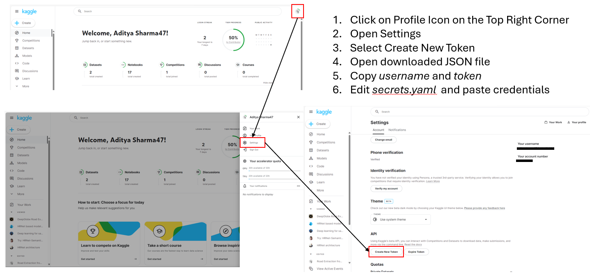

# Deep Globe Road Extraction using Convolutional Neural Networks


### First time instructions

1. Clone Repository using GitHub CLI or Git

    ```git clone https://github.com/geovicco-dev/deepgloberoadextraction.git ```

    or

    ```gh clone repo https://github.com/geovicco-dev/deepgloberoadextraction.git```

2. Run Python script to set up project folder structure

    ```python project_template.py```

3. Install `uv` package and create virtual environment

    ```pip install uv && uv venv --python=3.10 .venv```  

4. Activate virtual environment

    ```source ./.venv/bin/activate```

5. Install dependencies listed in `requirements.txt`

    ```uv pip install -r requirements.txt```

6. Install project as a package in editable mode

    ```uv pip install -e .```

7. Obtain Kaggle Credentials and Copy to `secrets.yaml`

4. Execute `python main.py`
